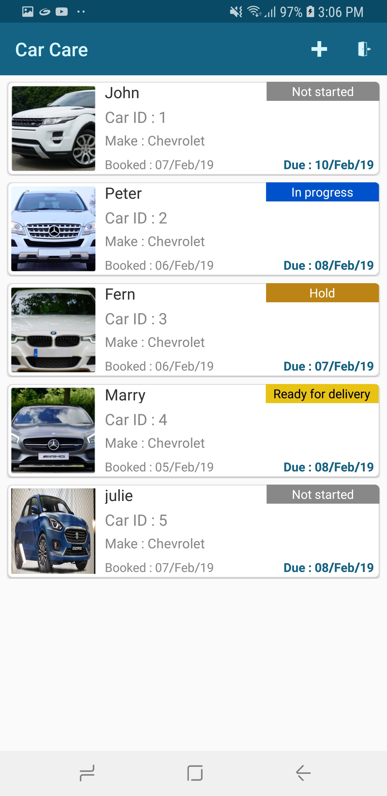
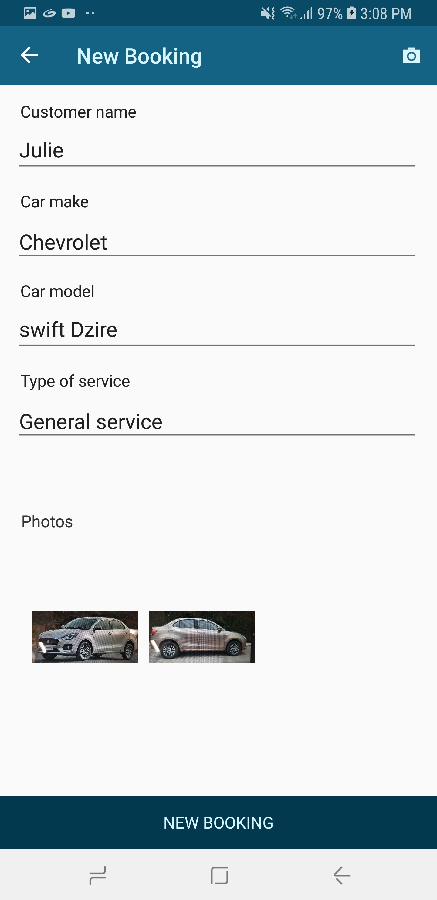
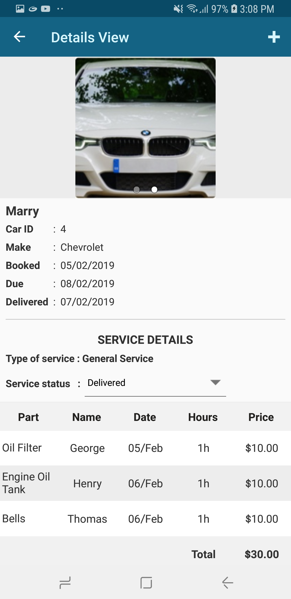
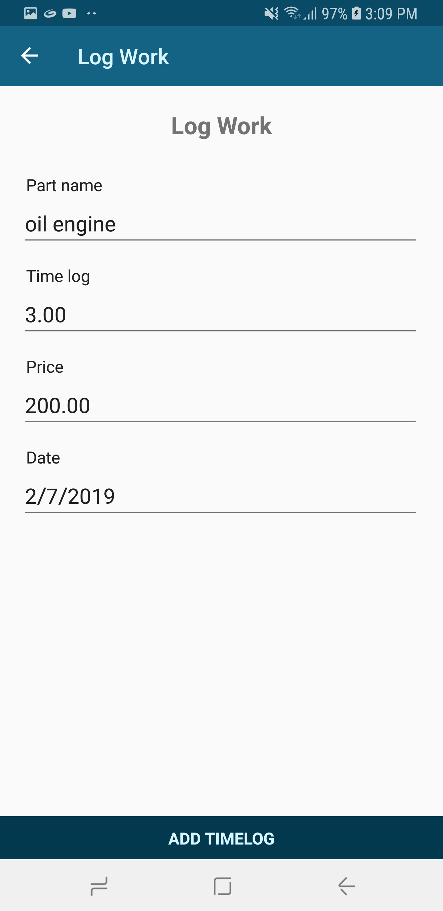
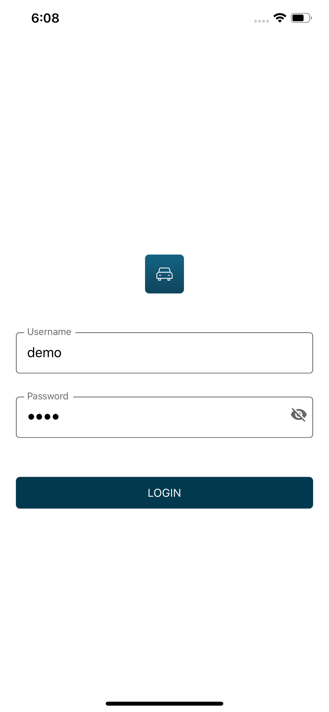
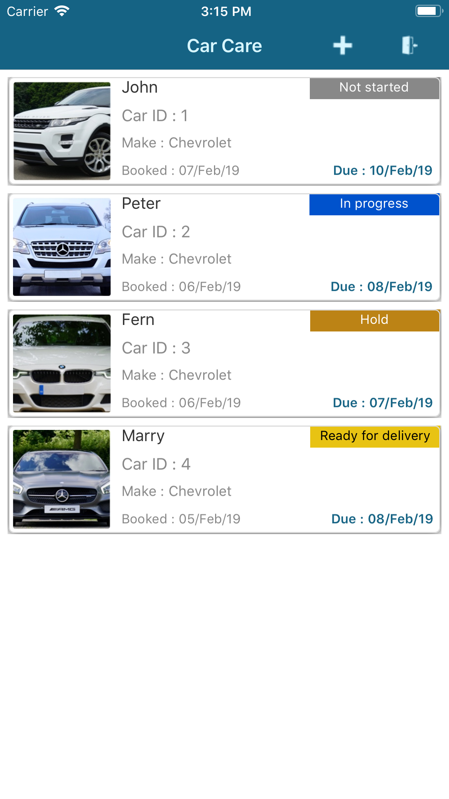
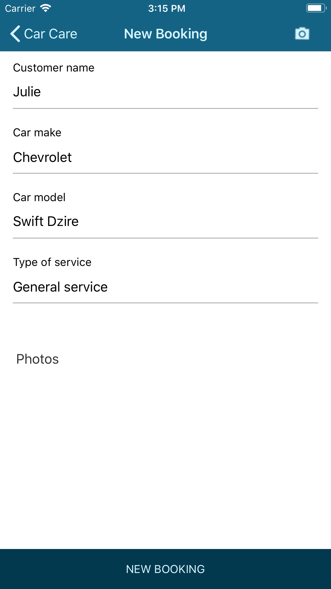
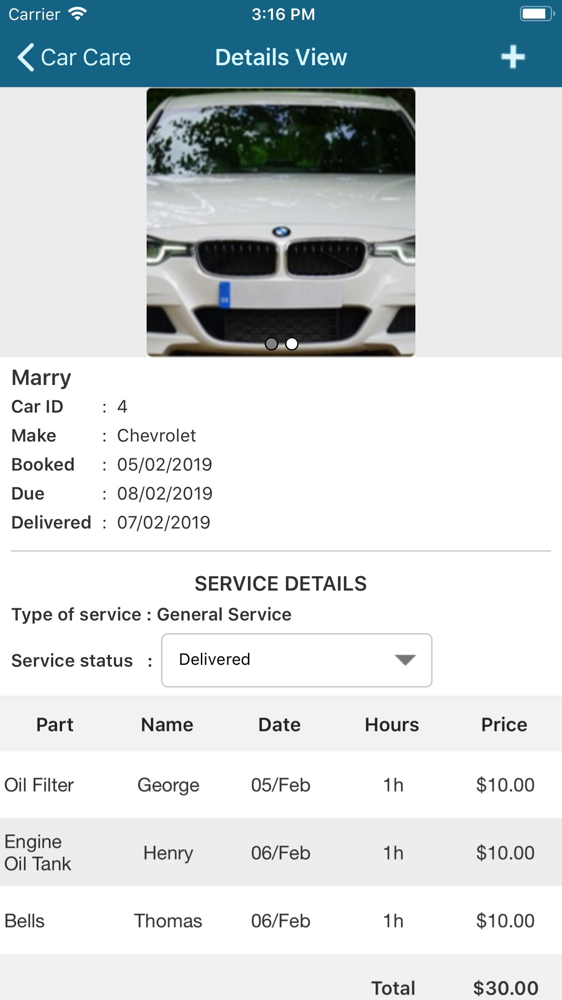
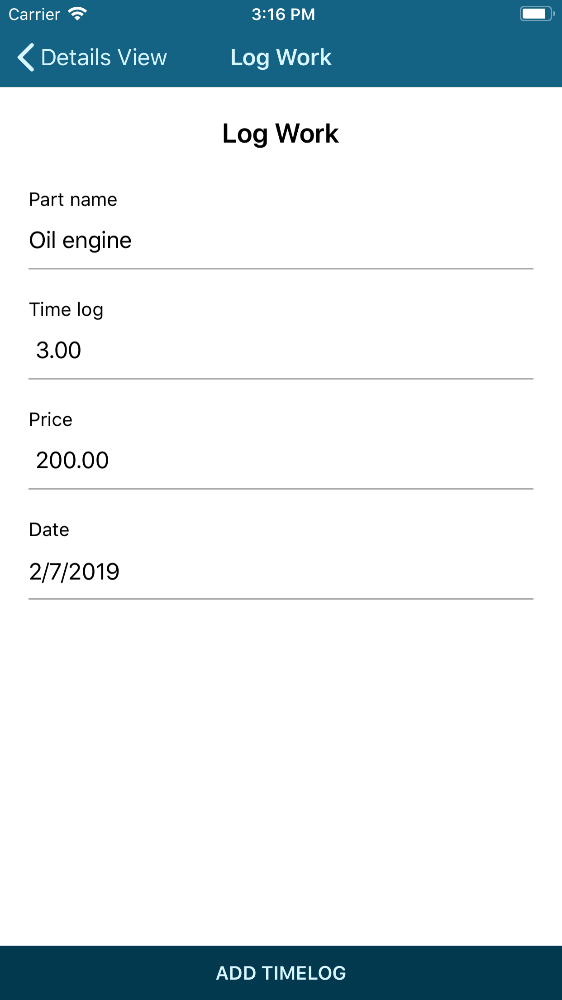

# Car Care

Car care is an application developed using Xamarin.Forms and Syncfusion controls for the usages in car service companies. The users can add a new car details, capture the photos of damaged parts, and add work log for their work.

This project uses the following patterns and features:

* XAML UI
* Converters
* Custom controls
* Data binding
* Behaviours
* MVVM
* Xamarin.Essentials
* Localization
* Styles
* Dependency injection
* Sqlite - database connection
* Phone and tablet layouts

## Syncfusion controls

This project uses the following Syncfusion controls:

* [SfDataGrid](https://www.syncfusion.com/xamarin-ui-controls/datagrid)
* [SfTabView](https://www.syncfusion.com/xamarin-ui-controls/tabbed-view)
* [SfTextInputLayout](https://www.syncfusion.com/xamarin-ui-controls/text-input-layout)
* [SfBusyIndicator](https://www.syncfusion.com/xamarin-ui-controls/busy-indicator)
* [SfComboBox](https://www.syncfusion.com/xamarin-ui-controls/combobox)
* [SfDataForm](https://www.syncfusion.com/xamarin-ui-controls/dataform)
* [SfListView](https://www.syncfusion.com/xamarin-ui-controls/listview)
* [SfRotator](https://www.syncfusion.com/xamarin-ui-controls/rotator)
* [SfButton](https://www.syncfusion.com/xamarin-ui-controls/button)

## Key features

* Provides overview of the cars available for service.
* Provides details of the individual cars with current service status and due date.
* Captures images of the damaged parts of the cars when giving to service.
* Logs the work with parts used for the service.

## Screens

### Android

    

### iOS

    

## Supported platforms

| Platforms | Supported versions |
| --------- | ------------------ |
| Android   | API level 21 and later versions |
| iOS | iOS 9.0 and later versions |

Refer to the following link for more details: 
[System Requirements](https://help.syncfusion.com/xamarin/installation-and-upgrade/system-requirements)

## Licenses

This application uses the following third party assemblies.

* [Xamarin.Essentials](https://github.com/xamarin/Essentials)
* [Plugin.Permissions](https://github.com/jamesmontemagno/PermissionsPlugin)
* [SqlLiteNetExtension.Async](https://bitbucket.org/twincoders/sqlite-net-extensions/src/master/)
* [Xam.Plugin.Media](https://github.com/jamesmontemagno/MediaPlugin)

## Inputs

Please enter the following credentials to access the functionalities of this application.

* Username :- demo
* Password :- demo

## Requirements to run demo

* [Visual Studio 2017](https://visualstudio.microsoft.com/downloads/) or [Visual Studio for Mac](https://visualstudio.microsoft.com/vs/mac/)
* Xamarin add-ons for Visual Studio (available in Visual Studio installer)

## How to run the sample

1. Clone the sample and open it in Visual Studio.

   *Note: If you download the sample using the "Download ZIP" option, right-click it, select Properties, and then select Unblock.*

2. Register your license key in the App.cs file as demonstrated in the following code.

        public App()
        {
            //Register Syncfusion license
            Syncfusion.Licensing.SyncfusionLicenseProvider.RegisterLicense("YOUR LICENSE KEY");

            InitializeComponent();

            MainPage = new MasterDetail();
        }

Refer to this [link](https://help.syncfusion.com/common/essential-studio/licensing/license-key#xamarinforms) for more details.

3. Set any one of the platform specific projects (iOS, Android) as a start-up project.
4. Clean and build the application.
5. Run the application.

## License

Syncfusion has no liability for any damage or consequence that may arise by using or viewing the samples. The samples are for demonstrative purposes, and if you choose to use or access the samples, you agree to not hold Syncfusion liable, in any form, for any damage that is related to use, for accessing, or viewing the samples. By accessing, viewing, or seeing the samples, you acknowledge and agree Syncfusion’s samples will not allow you seek injunctive relief in any form for any claim related to the sample. If you do not agree to this, do not view, access, utilize, or otherwise do anything with Syncfusion’s samples.
